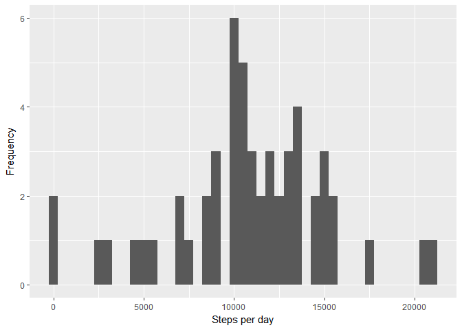
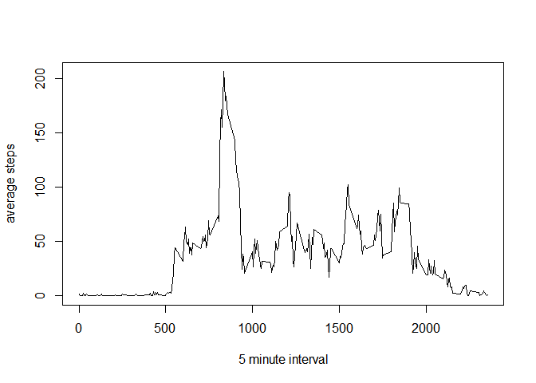
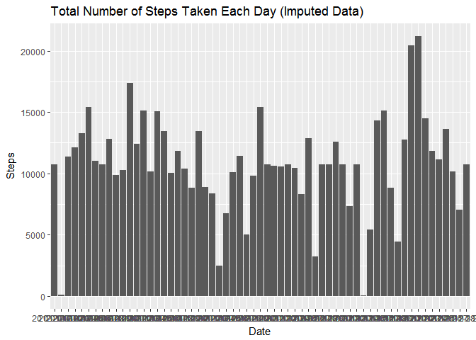
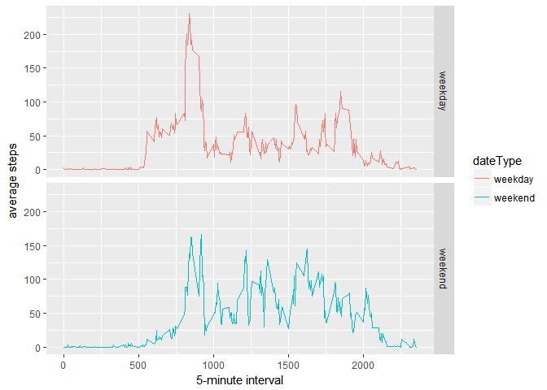

# Reproducible Research: Peer Assessment 1
Cody Weston, PhD  
March 8, 2016  

```r
library(dplyr)
```

```
## 
## Attaching package: 'dplyr'
```

```
## The following objects are masked from 'package:stats':
## 
##     filter, lag
```

```
## The following objects are masked from 'package:base':
## 
##     intersect, setdiff, setequal, union
```

```r
library(ggplot2)
```

###About: This is the first peer-graded assignment for the reproducible research course in the data science specialization available on Coursera, provided by Johns Hopkins University. 

##The goal of this project was to practice 

* Loading and preprocessing data
* Imputing missing values
* Answering research questions using data


##Data

The data for this assignment can be found on the course website: 
* Dataset: [Activity monitoring data](https://d396qusza40orc.cloudfront.net/repdata%2Fdata%2Factivity.zip)

The dataset is a CSV (comma-separated-variable) file with 17,568 observations. The columns are:

* steps: The number of steps walked as recorded over a given five minute interval
* date: The date of the measurement in YYYY-MM-DD format
* interval: The five minute interval over which the measurement was taken


## Loading and preprocessing the data

```r
activity <- read.csv("activity.csv")
validActivity <- activity[complete.cases(activity), ]
```

## What is mean total number of steps taken per day?

```r
dailySteps <- aggregate(validActivity$steps, by = list(Category = validActivity$date), sum)
qplot( x = dailySteps$x, xlab = "Steps per day", ylab = "Frequency", binwidth = 500)
```

<!-- -->

```r
mean = mean(dailySteps$x)
median = median(dailySteps$x)
```

## What is the average daily activity pattern?

```r
averageDay <- aggregate(validActivity$steps, by = list(Category = validActivity$interval), mean)
plot(type = "l", averageDay, xlab = "5 minute interval", ylab = "average steps")
```

<!-- -->

```r
#get the time point with the most steps
maximumTime = subset(averageDay, averageDay$x == max(averageDay$x))

#the time at which the maximum step count occurs, on average
print("The time representing the maximum average step count is:") 
```

```
## [1] "The time representing the maximum average step count is:"
```

```r
print(maximumTime$Category)
```

```
## [1] 835
```


## Imputing missing values

```r
# Determine missing values
missingVals <- length(which(is.na(activity$steps)))

# Fill in all missing values (fill in with the average)
imputedActivity <- activity
for (i in 1:nrow(imputedActivity)) {
    if (is.na(imputedActivity$steps[i])) {
        imputedActivity$steps[i] <- averageDay[which(imputedActivity$interval[i] == averageDay$Category), ]$x
    }
}
plot3 <- ggplot(imputedActivity, aes(date, steps)) + geom_histogram(stat = "identity",binwidth = .5) +
        labs(title = "Total Number of Steps Taken Each Day (Imputed Data)",x = "Date", y = "Steps")
```

```
## Warning: Ignoring unknown parameters: binwidth, bins, pad
```

```r
print(plot3)
```

<!-- -->

```r
imputedSteps <- tapply(imputedActivity$steps, imputedActivity$date, FUN = sum)
mean(imputedSteps)
```

```
## [1] 10766.19
```

```r
median(imputedSteps)
```

```
## [1] 10766.19
```

## Are there differences in activity patterns between weekdays and weekends?

```r
imputedActivity$dateType <-  ifelse(as.POSIXlt(imputedActivity$date)$wday %in% c(0,6), 'weekend', 'weekday')
averagedData <- aggregate(imputedActivity$steps,
                          list(interval = as.numeric(as.character(imputedActivity$interval)),
                               dateType = imputedActivity$dateType),
                          FUN = "mean")
names(averagedData)[3] <- "AverageSteps"


ggplot(averagedData, aes(interval, AverageSteps)) + 
    geom_line(aes(colour = dateType)) + 
    facet_grid(dateType ~ .) +
    xlab("5-minute interval") + 
    ylab("average steps")
```

<!-- -->
